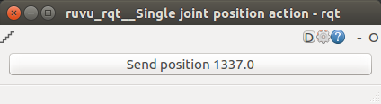
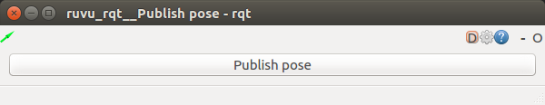

<!--
Copyright 2020 RUVU Robotics B.V.
-->

# RUVU RQT

## Nodes

### rqt.bash

Starts an rqt instance and optionally copies an rviz config to the default location. This scripts is required because
rviz in rqt cannot load proper rviz configs.

```
Usage: ./rqt.bash [rqt_perspective] [rviz_config] (optional)
```

### single_joint_position_action

Launches a widget with the single joint position action plugin.



### publish_pose

Launches a widget with the Publish pose plugin.



## Plugins

### publish_pose.PublishPosePlugin

Widget that publishes a pose based on a transformation available via TF. The user can specify the following:

- source_frame
- target_frame
- transform_timeout
- output topic (PoseStamped)

These parameters can be configured via the configuration button (gear-wheel).

### single_joint_position_action.SingleJointPositionActionPlugin

Widget that publishes a SingleJointPositionActionGoal. The user can specify the following:

- timeout
- position
- action_name

These parameters can be configured via the configuration button (gear-wheel).
