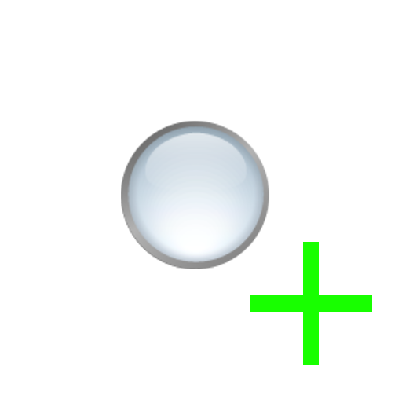
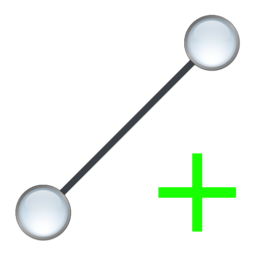
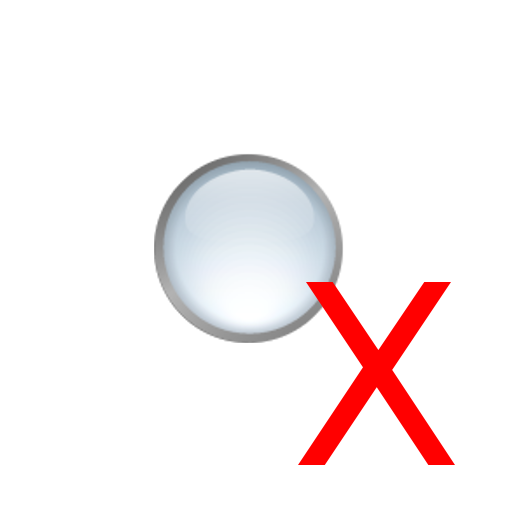
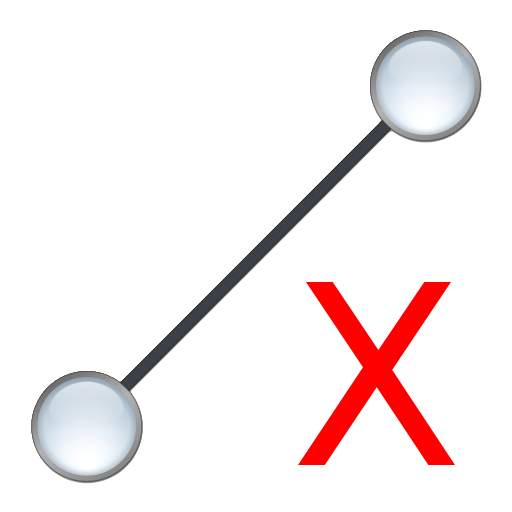

# RUVU RVIZ Plugins

Additional rviz plugins.

## Dock goal

Tool for sending a `geometry_msgs/PoseStamped` for a docking action to a specific topic via rviz. The output topic can be configured.

## Graph goal

Tool for sending a `geometry_msgs/PoseStamped` for a graph navigation action to a specific topic via rviz. The output topic can be configured.

## Configurable goal

Tool for sending a `geometry_msgs/PoseStamped` to a topic of that type within a namespace. The user is prompted to which topic when a goal has been set.

## Add node

Tool for sending a `geometry_msgs/PoseStamped` for adding a pose to a graph. The output topic can be configured.

## Add edge

Tool for sending a `geometry_msgs/PointStamped` for adding edges to graphs. The output topic can be configured. The receiving
end is responsible for collecting consecutive clicks.

## Remove node

Tool for sending a `geometry_msgs/PointStamped` for removing a pose from a graph. The output topic can be configured.

## Remove edge

Tool for sending a `geometry_msgs/PointStamped` for removing edges from a graph. The output topic can be configured. 
