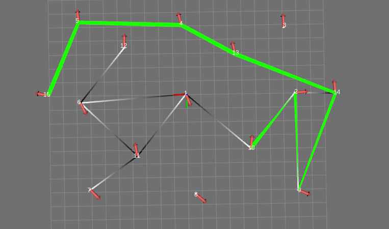

# RUVU NetworkX pose graph

ROS wrapper around the networkx library of python. The wrapper enables creating graphs using rviz and plan in these graphs. It can substitute a normally used grid based global planner.



## Nodes

### [pose_graph_node.py](scripts/pose_graph_node.py)

PoseGraphNode that holds a pose graph that can be created and modified by the user. This pose graph can be used to search paths.

#### Interfaces

##### Publishers

- graph_visualization ([visualization_msgs/MarkerArray](http://docs.ros.org/api/visualization_msgs/html/msg/MarkerArray.html)) - Visualization of the graph for RVIZ
- last_planned_path ([nav_msgs/Path](http://docs.ros.org/api/nav_msgs/html/msg/Path.html)) - Planned path output, also primarily for RVIZ

##### Subscribers

- add_node ([geometry_msgs/PoseStamped](http://docs.ros.org/api/geometry_msgs/html/msg/PoseStamped.html)) - Add a pose to the graph
- remove_node ([geometry_msgs/PointStamped](http://docs.ros.org/api/geometry_msgs/html/msg/PointStamped.html)) - Remove closest pose
- add_edge ([geometry_msgs/PointStamped](http://docs.ros.org/api/geometry_msgs/html/msg/PointStamped.html)) - Add an edge (select two consecutive closest poses)
- get_path ([geometry_msgs/PointStamped](http://docs.ros.org/api/geometry_msgs/html/msg/PointStamped.html)) - Plan a path (select two consecutive closest poses)

##### Actions
- get_path ([GetPathAction](https://github.com/magazino/move_base_flex/blob/master/mbf_msgs/action/GetPath.action)) - Plan a path
  * There are two planners available:
    - `topological` just plan along the graph
    - `global` interpolate between points and include the last pose

##### Services

- clear ([std_srvs/Empty](http://docs.ros.org/api/std_srvs/html/msg/Empty.html)) - Clear the graph
- store ([std_srvs/Empty](http://docs.ros.org/api/std_srvs/html/msg/Empty.html)) - Store the graph to the `file_path`

#### Parameters

- ~frame_id (`default="map"`) - Frame id of the graph
- ~robot_frame_id (`default="base_link"`) - Frame id of the robot, used when a plan is requested and `use_start_pose` is `false`
- ~file_path (`default="/tmp/pose_graph"`) - Where to load / store the graph
- ~click_timeout (`default=5.0` - When adding and edge or planning a path using the corresponding topic interfaces, this timeout is used for selecting consecutive poses.
- ~interpolation_distance (`default=0.2`) - Path interpolation
- ~neglect_goal_orientation (`default=False`) - When true, the last pose of the by `/get_path` returned path has an orientation equal to the last nodes' orientation instead of the goal's orientation.

### [generate_grid_graph](scripts/generate_grid_graph)
This script can be used to generate a grid of nodes. Several arguments can be given to the script to modify the resulting grid. Run the script with `--help` to see how to use it:
```bash
generate_grid_graph --help
```

## Internal data structure
The representation of the graph on disk is a networkx graph. Each node is a unique integer. Each node has the following attributes:
```
pose: geometry_msgs/Pose
```

## Tests

### [draw_pose_graph.py](test/draw_pose_graph.py)
```
usage: Draw pose graph using matplotlib [-h] input_file

positional arguments:
  input_file
```

### [generate_random_pose_graph.py](test/generate_random_pose_graph.py)
```
usage: Generate random pose graph [-h] output_file

positional arguments:
  output_file
```

### [get_path.py](test/get_path.py)
Creates an actionlib client and queries the planner in the `pose_graph_node.py` node. The user can provide a starting point (x1, y1) and an end point (x2, y2).
```
usage: Get path from the pose graph [-h] [--frame_id FRAME_ID]
                                    [--tolerance TOLERANCE]
                                    x1 y1 x2 y2

positional arguments:
  x1
  y1
  x2
  y2

optional arguments:
  -h, --help            show this help message and exit
  --frame_id FRAME_ID
  --tolerance TOLERANCE
```

### [publish_pose_graph_ros_visualization.py](test/publish_pose_graph_ros_visualization.py)
Publishes a pose graph to rviz as [visualization_msgs/MarkerArray](http://docs.ros.org/api/visualization_msgs/html/msg/MarkerArray.html)
```
usage: Publish pose graph as visualization_msgs/MarkerArray
       [-h] [--frame_id FRAME_ID] input_file

positional arguments:
  input_file
```
