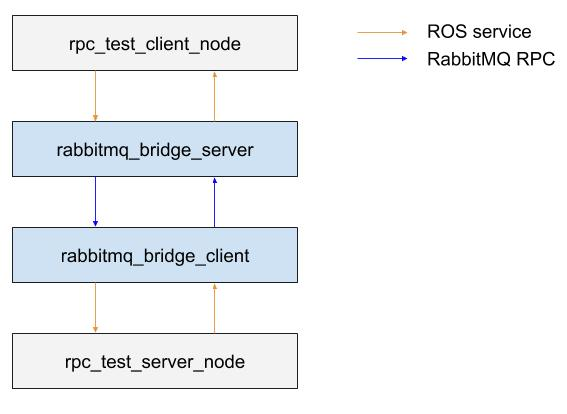

# RUVU RabbitMQ Bridge

Bridges between [ROS](http://ros.org) and [RabbitMQ](https://www.rabbitmq.com/).

## Nodes

### rabbitmq_bridge

```
rosrun ruvu_rabbitmq_bridge rabbitmq_bridge
```

In and output topic are specified using the parameters. The node will publish heartbeat diagnostics that denote whether 
the rabbitmq server can be reached.

#### Parameters

- `~subscribers`: List with topic and message type entries. A ROS subscriber will be created and every message will be published to RabbitMQ.
- `~publishers`: List with topic and message type entries. A RabbitMQ subscriber will be created and every message will be published to the ROS network on the specified topic.
- `~servers`: List with service and message type entries. A ROS service server will be created and every request message will be published using a Remote Procedure Call (RPC) to RabbitMQ. The returned RPC response is thereafter published on the ROS network as service response. 
- `~clients`: List with service and message type entries. A RabbitMQ RPC server will be created and every RPC request message will be published to the ROS network as a service request. The returned ROS service response is thereafter published on the RabbitMQ network as a RPC response. 
- `~rabbitmq_queue_prefix`: This prefix will be prepended to the specified topic names in the `~subscribers` and `~publishers` parameters for the RabbitMQ queue name.
- `~rabbitmq_host`: The RabbitMQ host
- `~rabbitmq_virtual_host`: The RabbitMQ virtual host name (defaults to `'/'`)
- `~rabbitmq_username`: The RabbitMQ username (defaults to `''`)
- `~rabbitmq_password`: The RabbitMQ password (defaults to `''`)
- `~rabbitmq_reconnect_timeout`: How long to wait before reconnecting if the initial connection fails (defaults to `5`)
- `~rabbitmq_heartbeat`: Checks whether the RabbitMQ server can still be reached (defaults to `0`, no checking)
- `~ros_publishere_queue_size`: Queue size on the ROS end (only holds for the specified `~publishers`).
- `~ros_queue_empty_timeout`: How long to sleep if there are no incoming ROS msgs in the queue. (default=`0.01`)
- `~ros_service_response_timeout`: How long to wait for a ROS service response [seconds], before passing an error to the client. (default=`1`)

Example parameter file:

```
subscribers:
  - topic: prefix/string_to_rabbitmq
    message_type: std_msgs/String
    exchange: Example.Exchange
    durable: true
  - topic: float_to_rabbitmq
    message_type: std_msgs/Float32
    exchange: Example.Exchange2
    durable: false
publishers:
  - topic: string_from_rabbitmq
    message_type: std_msgs/String
    exchange: Example.Exchange
    durable: true
  - topic: prefix/twist_from_rabbitmq
    message_type: geometry_msgs/Twist
    exchange: Example.Exchange2
    durable: false
servers:
  - topic: trigger_to_rabbitmq
    message_type: std_srvs/Trigger
    exchange: Example.Exchange
    durable: true
clients:
  - topic: bool_from_rabbitmq
    message_type: std_srvs/SetBool
    exchange: Example.Exchange
    durable: true
rabbitmq_host: localhost
rabbitmq_username: ''
rabbitmq_password: ''
rabbitmq_reconnect_timeout: 5
rabbitmq_heartbeat: 0
#rabbitmq_queue_prefix: custom_prefix # defaults to current hostname
ros_publisher_queue_size: 10 # defaults to 10
```

### Tests
##### test_rabbitmq_rpc
This tests the communication with ROS services over Rabbitmq using RPCs. It verifies the working of both a server and a client implementation of the rabbitmq_bridge, with an architecture as depicted below.


