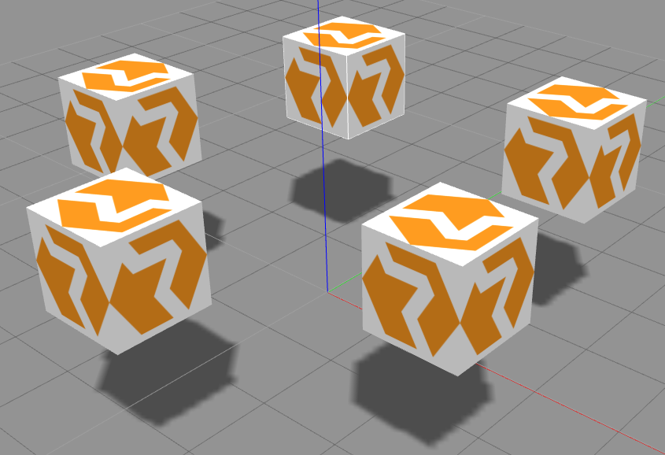
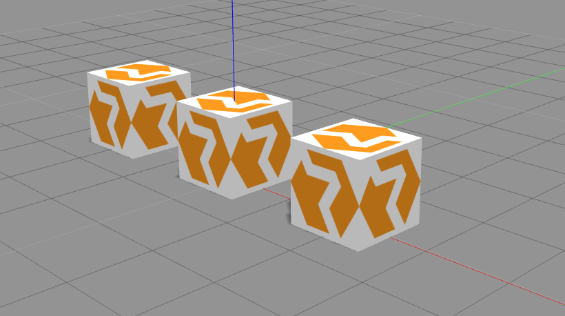
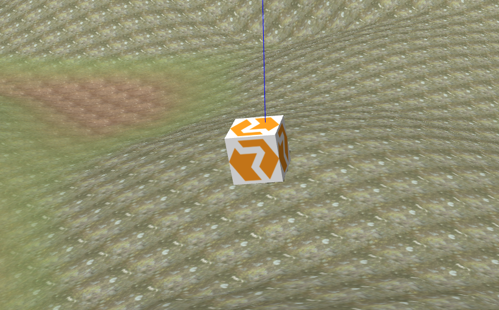
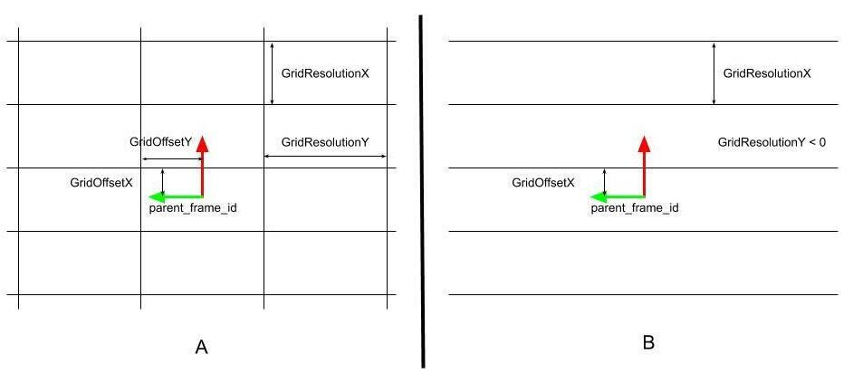

<!--
Copyright 2020 RUVU Robotics B.V.
-->

# RUVU Gazebo Plugins

This package holds several Gazebo plugins that make modification to the world
entities in the simulation environment or expose data to the outside world.
The plugins can be included by referring to the plugin in the Gazebo world file
or in the URDF description. Examples can be found in the
[test directory](/test).

    <plugin name="[NAME]" filename="lib[NAME].so">
      <param1>value1</param1>
    </plugin>

## Plugins

The following plugins are present within this package:

### ruvu_disable_physics (world plugin)

This plugin disables the physics engine when it is on. Often we are not
interested in exact physics simulation, it is cheaper (computationally) to
ignore the physics and thus the collision engine. This gives us full control
over the state-evolution in simulation.

### ruvu_twist_teleport (model plugin)

This plugin teleports entity in the scene base on a [geometry_msgs/Twist](http://docs.ros.org/api/geometry_msgs/html/msg/Twist.html)
command and publishes an
[nav_msgs/Odometry](http://docs.ros.org/api/nav_msgs/html/msg/Odometry.html).
This plugin assumes that the physics are disabled and assumes infinite
acceleration.

#### Parameters

- `robotNamespace`: Namespace of the plugin, also used to extract the `tfPrefix`
(default=`''`)
- `commandTopic`: Topic name of the incoming [geometry_msgs/Twist](http://docs.ros.org/api/geometry_msgs/html/msg/Twist.html)
 messages (default=`'cmd_vel'`)
- `commandTimeout`: Time for an input command to be valid (default=`0.5`)
- `odometryTopic`: Topic name of the outgoing  [nav_msgs/Odometry](http://docs.ros.org/api/nav_msgs/html/msg/Odometry.html)
message (default=`'odom'`)
- `odometryFrame`: Odom frame id (fixed frame to the world) (default=`odom`)
- `odometryRate`: Frequency of the odometry that is being published
(default=`20`)
- `robotFrame`: Frame id attached to the robot (default=`base_link`)

### ruvu_twist_move (model plugin)

This plugin moves the entity in the scene base on a [geometry_msgs/Twist](http://docs.ros.org/api/geometry_msgs/html/msg/Twist.html)
command and publishes an
[nav_msgs/Odometry](http://docs.ros.org/api/nav_msgs/html/msg/Odometry.html).
This plugin assumes physics and applies infinite acceleration.

#### Parameters

- `robotNamespace`: Namespace of the plugin, also used to extract the `tfPrefix`
(default=`''`)
- `commandTopic`: Topic name of the incoming [geometry_msgs/Twist](http://docs.ros.org/api/geometry_msgs/html/msg/Twist.html)
 messages (default=`'cmd_vel'`)
- `commandTimeout`: Time for an input command to be valid (default=`0.5`)
- `odometryTopic`: Topic name of the outgoing  [nav_msgs/Odometry](http://docs.ros.org/api/nav_msgs/html/msg/Odometry.html)
message (default=`'odom'`)
- `odometryFrame`: Odom frame id (fixed frame to the world) (default=`odom`)
- `odometryRate`: Frequency of the odometry that is being published
(default=`20`)
- `robotFrame`: Frame id attached to the robot (default=`base_link`)

### ruvu_accerion_triton (model plugin)
The plugin is an adaption of the [gazebo_ros_p3d plugin](https://github.com/ros-simulation/gazebo_ros_pkgs/blob/kinetic-devel/gazebo_plugins/src/gazebo_ros_p3d.cpp).
It is altered to output the gazebo ground truth position when the sensor link crosses a virtual grid line.
As the p3d, it publishes [nav_msgs/Odometry](http://docs.ros.org/api/nav_msgs/html/msg/Odometry.html) messages on the selected topic.
In the drawing below various parameters describing the virtual grid (representing the floor mapping) are explained.

#### Parameters derived from p3d
- `robotNamespace`: Namespace of the plugin, also used to extract the `tfPrefix`
(default=`''`)
- `sensorFrameId`: Sensor frame id
- `parentFrameId`: Parent frame id (default=`'world'`)
- `topicName`: Topic on which odom the message is published
- `xyzOffset`: Added xyz offset [m] to retrieved pose (default=`0 0 0`)
- `rpyOffset`: Added rpy offset [rad] to retrieved pose (default=`0 0 0`)
- `gaussianNoise`: Added gaussian noise to retrieved pose covariance (default=`0 0 0`)

#### Triton specific parameters
- `outputFrameId`: Frame id which's position is returned by the plugin
- `maxPublishRate`: Maximum rate [hz] for the out coming odom messages, to mimic the hardware limitations.
  - `0` = as fast as possible
  - default = `1`
- `GridResolutionX`: Grid cell size [m] in x-direction
  - `<0` = No grid lines in y-direction
  - `0` = unlimited grid lines in y-direction (mimics p3d behaviour)
  - default = `1`
- `GridResolutionY`: Grid cell size [m] in y-direction
  - `<0` = No grid lines in x-direction
  - `0` = unlimited grid lines in x-direction (mimics p3d behaviour)
  - default = `1`
- `GridOffsetX`: Grid offset [m] in x-direction (default=`0`)
- `GridOffsetY`: Grid offset [m] in y-direction (default=`0`)
- `xyThreshold`: If the current position of `sensorFrameId` is within this threshold distance [m] from a virtual grid line, the plugin is triggered to output an odom message (default=`0.01`)
- `publishDelay`: Delay [s] for outgoing odom messages to mimic the hardware limitations (default=`0`)
